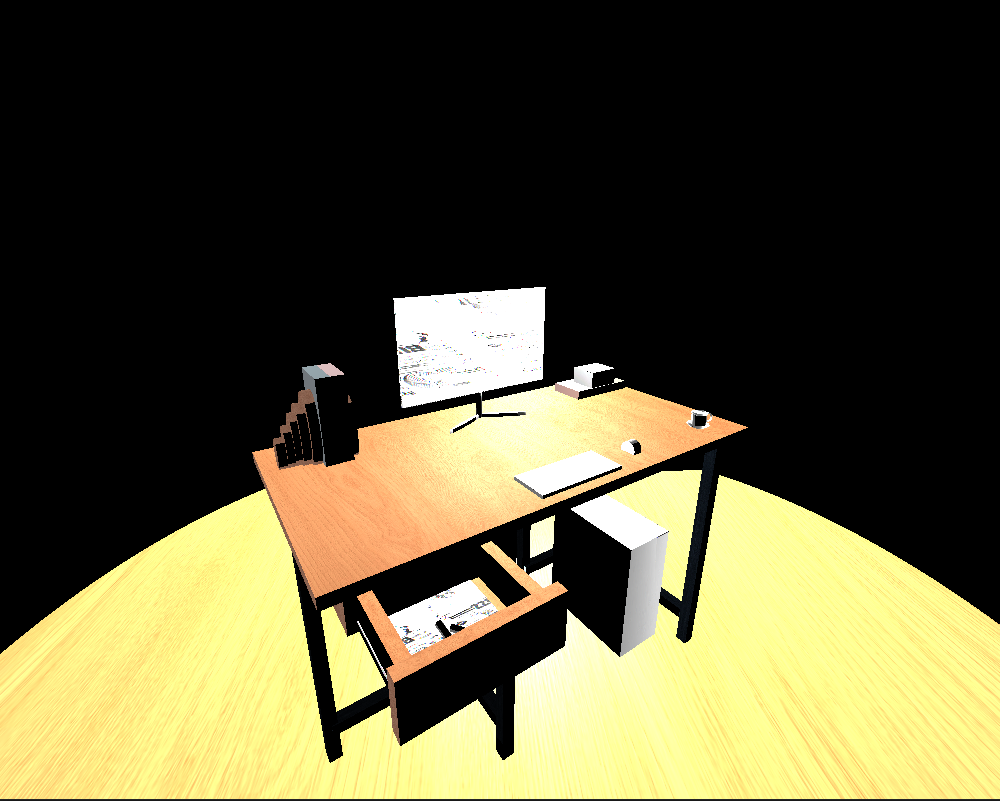

# 3D Workspace Rendering

The completion of this project has pushed me another step towards my goal of becoming a successful software engineer. When I approach designing software, I like to begin by thoroughly examining the requirements and working to implement them one by one. This project has helped me acquire the new design skill of being able to read intricate code and add to it. The design process for this project consisted of perfecting the main object in the scene, the desk, and slowly adding to it. Design tactics from this design approach could be applied in future work by prioritizing the main functionality of a program and adding to it. Overall, I approach program development by beginning to formulate ideas for how I could get it to work and trying them after thorough consideration. A new development strategy I used while working on this scene was perfecting the main portion and branching out. Iteration factored into the development of this project as I slowly perfected the desk and proceeded to branch out and perfect the smaller objects in the workspace. My approach to developing code evolved throughout the milestones as I eventually focused more on polishing the enitre scene at the end. Computer science can help me reach my goals by giving me the skillset required for my dream job which software engineering. Computational graphics and visualizations give me new knowledge that I can use to develop visuals in programs in my future educational pathway. Furthermore, I now have the skillset to apply these graphics to any work I contribute to as a software engineer. 
